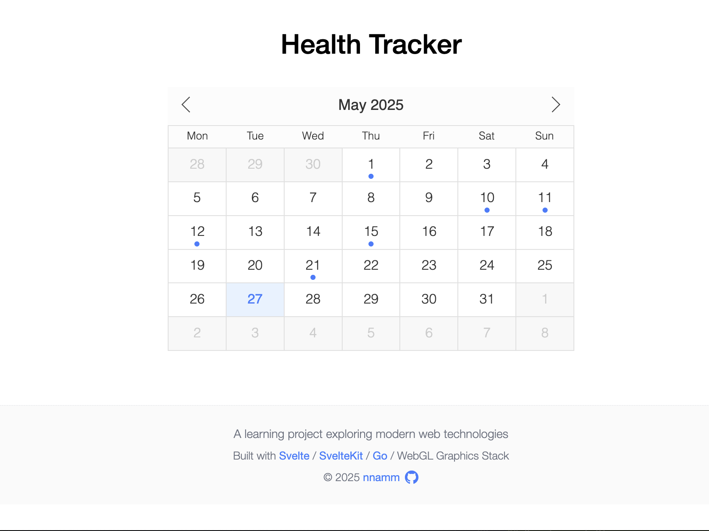
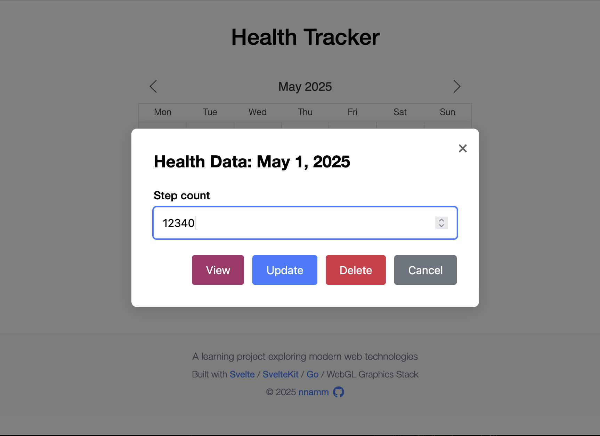
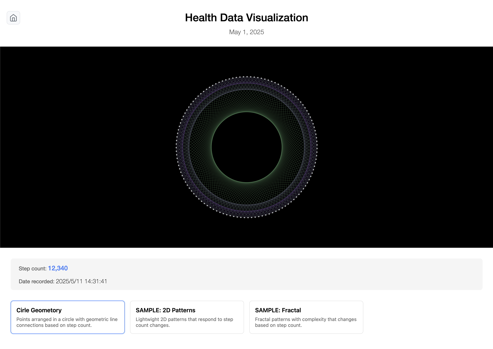

# Svelte Health Metrics Frontend

A responsive Svelte interface for interacting with the Go & SQLite3 health tracking backend.

## Purpose

This project implements a user-friendly frontend to interact with the Go and SQLite3-powered backend CRUD operations. It aims to provide a seamless user experience for recording and retrieving health metrics such as step counts, with plans to add more health metrics in future phases.

## Setup Instructions

1. Clone the repository:

   ```
   git clone https://github.com/nnamm/svelte-health-tracker.git
   cd svelte-health-tracker
   ```

2. Install dependencies:

   ```
   npm install
   ```

3. Configure environment variables:

   - Create a `.env` file with:

     ```
     VITE_API_BASE_URL=http://localhost:8000
     VITE_API_ENDPOINT=/health/records
     ```

4. Start the development server:

   ```
   npm run dev
   ```

5. Build for production:

   ```
   npm run build
   ```

## Screenshots







## Key Features

- **Calendar-Based Interface**: Interactive calendar for date selection
- **Health Data Management**: Create, read, update, and delete step count records
- **Visual Indicators**: Calendar highlights days with existing health data
- **Year/Month Navigation**: Easily navigate between different months and years
- **Data Visualization**: Multiple visualization strategies using p5.js and Three.js
- **Responsive Design**: Works across desktop and tablet devices

## Tech Stack

- **Framework**: SvelteKit with Svelte 5
- **Language**: TypeScript
- **State Management**: Svelte's built-in reactive primitives (`$state`, `$derived`, `$effect`)
- **HTTP Client**: Axios for API communication
- **Date Handling**: date-fns
- **Visualization**: p5.js, Three.js for health data visualization
- **Styling**: Component-scoped CSS
- **Backend Communication**: REST API integration with go-health-tracker

## Development Plans

### Phase 1: Basic Features Implementation (Completed)

- Calendar interface development
- Health data input and display functionality
- REST API integration with backend
- Basic UI/UX implementation
- Component structure establishment

### Phase 2: Enhanced Features and Visualization (Completed)

- **Component Enhancements**
  - HealthDataModal improvements with auto-focus functionality
  - CalendarGrid enhancements with health data tooltips on hover
- **Visualization System Implementation**
  - Strategy and Factory pattern implementation for flexible visualization rendering
  - Multiple visualization algorithms using p5.js and Three.js
  - WebGL-based health data visualization with performance optimization
  - User-selectable visualization methods for dynamic health data representation
- **Quality Assurance**

  - Unit testing implementation with integration test coverage
  - Performance optimization for graphics rendering

### Phase 3: Advanced Features and Production Readiness (Planned)

- **User Experience Improvements**
  - Mobile responsiveness enhancements for 320px minimum width
  - Data trends and statistics display functionality
  - Extended calendar view with 3-month data range display
- **Backend Integration Enhancements**
  - Support for user authentication and management
  - Enhanced error handling and response consistency
  - Integration with improved REST API endpoints
- **Performance and Scalability**
  - Advanced graphics performance optimization
  - Progressive loading for large datasets
  - Enhanced caching strategies for visualization components

## License

MIT

## Reference

[nnamm/go-health-tracker](https://github.com/nnamm/go-health-tracker)
